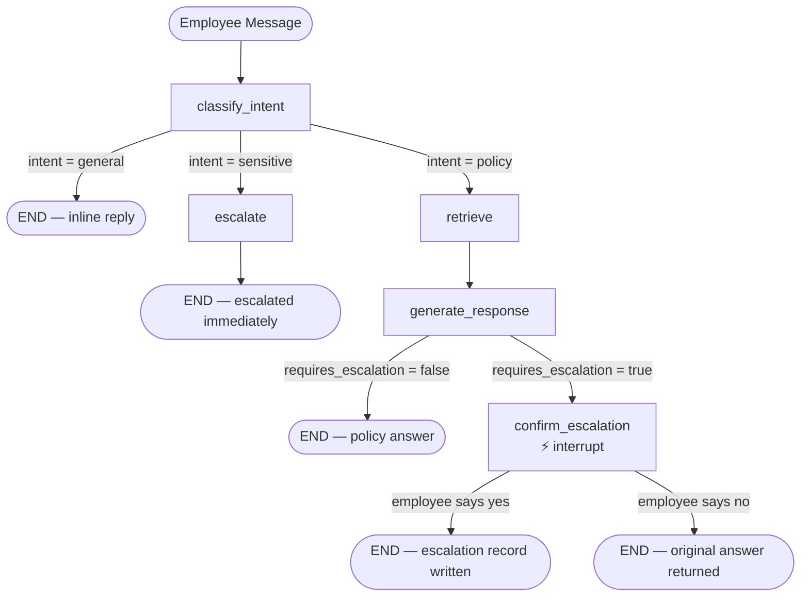

# Intelligent Operations Assistant

A stateful HR/IT policy chatbot built with **LangGraph**, **FastAPI**, **Google Gemini**, and **PostgreSQL + PgVector**. Employees ask natural-language questions about company policies; the assistant retrieves the most relevant documents from the knowledge base, generates a grounded answer, and escalates to the appropriate team when self-service is not possible.

---

## Table of Contents

1. [Architecture Overview](#architecture-overview)
2. [LangGraph Workflow](#langgraph-workflow)
3. [Directory Structure](#directory-structure)
4. [Tech Stack](#tech-stack)
5. [Environment Configuration](#environment-configuration)
6. [Installation & Setup](#installation--setup)
7. [API Specification](#api-specification)
8. [Knowledge Base — Document Ingestion](#knowledge-base--document-ingestion)
9. [Observability — MLflow](#observability--mlflow)
10. [Pre-Push Checklist](#pre-push-checklist)
11. [License](#license)

---

## Architecture Overview

```
Employee message
      │
      ▼
┌─────────────────────────────────────────────────────────┐
│                     FastAPI (lifespan)                  │
│                                                         │
│  POST /api/v1/chat  ──►  AgentService.chat()            │
│                               │                         │
│                       LangGraph StateGraph              │
│                         (checkpointed in PG)            │
│                                                         │
│   classify_intent ──► retrieve ──► generate_response    │
│         │                               │               │
│    (sensitive)                  (requires escalation)   │
│         │                               │               │
│       escalate              confirm_escalation          │
│                                                         │
│  POST /api/v1/documents/upload ─► DocumentService       │
│        (PDF / DOCX / TXT)         (chunk → embed → PG)  │
│                                                         │
│  GET  /api/v1/health  ──► DB + PgVector probe           │
└─────────────────────────────────────────────────────────┘
      │                         │
      ▼                         ▼
 PostgreSQL                  PgVector
 (sessions, escalations,    (document_chunks —
  error logs, checkpointer)  HNSW cosine index)
```

**Key design principles:**

- **Retrieval-Augmented Generation (RAG):** Answers are grounded exclusively in uploaded policy documents — the LLM cannot hallucinate source names because retrieved sources are cross-checked before being returned.
- **Hybrid retrieval:** Semantic cosine similarity (PgVector) and keyword search (ParadeDB BM25) are fused via Reciprocal Rank Fusion (RRF) for maximum recall.
- **Human-in-the-loop escalation:** When the LLM determines a request cannot be self-served, the graph pauses with `interrupt()` and waits for the employee to confirm before writing an escalation record.
- **Persistent conversation state:** LangGraph checkpoints every turn in PostgreSQL, so sessions survive server restarts and support multi-turn context.
- **Dual message histories:** Intent classification and response generation maintain completely separate message histories to prevent context pollution.
- **Query optimisation:** `classify_intent` rewrites every user message into a clean, retrieval-ready `optimised_query` — expanding abbreviations, resolving pronouns from history, and using formal HR/IT terminology — before it reaches the vector store.

---

## LangGraph Workflow



### Node Responsibilities

| Node                   | What it does                                                                                                                                                                                                                                                                                                                                                                   |
| ---------------------- | ------------------------------------------------------------------------------------------------------------------------------------------------------------------------------------------------------------------------------------------------------------------------------------------------------------------------------------------------------------------------------ |
| **classify_intent**    | LLM structured-output call → `general` / `policy` / `sensitive`. Also produces `optimised_query` — a retrieval-ready rewrite of the user message. Inline reply for greetings. LLM reasons independently about sensitivity — no hardcoded keyword list. Writes to `intent_messages` only.                                                                                       |
| **retrieve**           | Hybrid PgVector cosine + ParadeDB BM25 search fused via RRF. Uses `optimised_query` (LLM-rewritten) as the primary search query. Sets `is_low_confidence` when the top RRF score is below threshold (`0.015`).                                                                                                                                                                 |
| **generate_response**  | Single structured LLM call (`GenerateDecision`). Uses `LowConfidenceGenerate` prompt when confidence is low. Handles infrastructure failures and empty result sets inline. Validates LLM-returned source names against actual retrieved docs. `response` always contains the substantive policy procedure — never a confirmation question. Writes to `generate_messages` only. |
| **escalate**           | Writes an escalation row immediately for sensitive intent — no employee confirmation required. Acknowledges the request using the LLM-rewritten `optimised_query` so the response is specific to what the employee asked.                                                                                                                                                      |
| **confirm_escalation** | `interrupt()` pauses the graph. On resume, employee `yes` writes the escalation row; `no` returns `state["response"]` — the substantive policy procedure the LLM already generated, never the escalation question (which lives separately in `escalation_prompt`).                                                                                                             |

---

## Directory Structure

```text
.
├── .env.example                  # Root-level environment template
├── .gitignore
├── .python-version               # Python 3.13+
├── pyproject.toml                # Dependencies and project metadata
├── uv.lock                       # Locked dependency graph
├── README.md                     # This file
│
├── api/
│   ├── api.yaml                  # OpenAPI 3.0.3 specification
│   └── design/
│       ├── Post.puml             # PlantUML sequence diagram
│       └── class.puml            # PlantUML class diagram
│
└── src/
    ├── .env                      # Local secrets (git-ignored)
    ├── .env.example              # src-level environment template
    ├── constant.py               # Global constants, Intent / NodeName / EscalationReason enums
    ├── main.py                   # FastAPI app factory, lifespan, exception handlers, Uvicorn runner
    ├── settings.py               # Dataclass config loader — reads from .env, raises on missing secrets
    │
    ├── agents/                   # Placeholder (reserved for future agent extensions)
    ├── clients/                  # Placeholder (reserved for future client wrappers)
    │
    ├── migration/
    │   └── migration.py          # Startup migration: pgvector extension + all application tables
    │
    ├── models/
    │   └── model.py              # APIResponse, ChatRequest, ChatResponseData, GraphState,
    │                             # IntentClassification (with optimised_query), GenerateDecision (Pydantic + TypedDict)
    │
    ├── prompt/
    │   └── prompt.py             # System prompts: ClassifyIntent, GenerateResponse, LowConfidenceGenerate
    │
    ├── repositories/
    │   ├── Database.py           # Singleton async SQLAlchemy engine + session factory
    │   ├── escalation_repository.py  # CRUD for escalations table
    │   ├── log_repository.py     # Inserts ErrorLogger rows
    │   ├── session_repository.py # CRUD for sessions table
    │   ├── vector_repository.py  # PgVector similarity search, ParadeDB BM25, atomic chunk replace
    │   └── schemas/
    │       └── schema.py         # ORM models: ErrorLogger, Employee, Session, Escalation
    │
    ├── routes/
    │   └── routes.py             # OpsRouter: POST /chat, POST /documents/upload, GET /health
    │
    ├── services/
    │   ├── agent_service.py      # AgentService: build_graph() factory + chat() entry point
    │   ├── conditional_edges.py  # route_after_classify(), route_after_generate()
    │   ├── document_service.py   # Ingest pipeline: validate → parse → chunk → embed → store
    │   ├── embedding_service.py  # GoogleEmbedding wrapper (gemini-embedding-2)
    │   ├── graph_nodes.py        # GraphNodes: all five LangGraph node callables
    │   ├── llm_service.py        # GeminiLlm wrapper (ChatGoogleGenerativeAI)
    │   └── retrieval_service.py  # Hybrid search: semantic + BM25 → RRF fusion
    │
    └── utils/
        ├── Exceptions/
        │   └── errorcodes.py     # ApplicationError, ErrorCode enum, factory helpers
        ├── error_log_handler_utils.py  # ErrorLogHandler — bridges Logger → LogRepository
        ├── logger.py             # Per-name Logger singleton with async DB persistence
        ├── mlflow_utils.py       # setup_mlflow(), attach_trace_tags(), log helpers
        └── response_utils.py     # ResponseFormatter — standard API envelope builder
```

---

## Tech Stack

| Layer                | Technology                                                         |
| -------------------- | ------------------------------------------------------------------ | --- | --- | ------------------------ |
| **Runtime**          | Python 3.13+                                                       |
| **Web framework**    | FastAPI `>=0.115`, Uvicorn `>=0.30`                                |
| **AI orchestration** | LangGraph `>=0.2`, LangChain `>=0.3`                               |
| **LLM**              | Google Gemini (`gemini-3.5-flash`) via `langchain-google-genai`    |
| **Embeddings**       | Google `gemini-embedding-2` (768-dim) via `langchain-google-genai` |
| **Vector store**     | PostgreSQL + `pgvector` (HNSW cosine index)                        |
| **Keyword search**   | ParadeDB BM25 (`                                                   |     |     | `operator,`pdb.score()`) |
| **Hybrid fusion**    | Reciprocal Rank Fusion (RRF, k=60) — in-process Python             |
| **Database ORM**     | SQLAlchemy 2.0 async (`asyncpg` driver)                            |
| **Checkpointer**     | `langgraph-checkpoint-postgres` (`AsyncPostgresSaver`)             |
| **Observability**    | MLflow (LangChain autolog + custom span tags)                      |
| **Config**           | `python-dotenv`, Pydantic `>=2.7`                                  |
| **Package manager**  | [uv](https://docs.astral.sh/uv/)                                   |

---

## Environment Configuration

Copy the example file to `src/.env` and fill in your values:

```bash
cp src/.env.example src/.env
```

```ini
# ── Google / Gemini ─────────────────────────────────────────────
GEMINI_API_KEY="your-gemini-api-key"
GEMINI_MODEL="gemini-3.5-flash"

# ── PostgreSQL ──────────────────────────────────────────────────
DB_HOST="localhost"
DB_PORT="5432"
DB_NAME="ops_db"
DB_USERNAME="postgres"
DB_PASSWORD="your-secure-password"    # required — app refuses to start if missing

# ── Server ──────────────────────────────────────────────────────
HOST="127.0.0.1"
PORT="8080"

# ── MLflow (optional) ───────────────────────────────────────────
MLFLOW_TRACKING_URI="http://localhost:5000"
MLFLOW_EXPERIMENT_NAME="ops_assistant"
```

> [!CAUTION]
> Never commit `.env` or any file containing real API keys to version control. `.gitignore` already blocks `.env` files.

---

## Installation & Setup

### Prerequisites

- Python 3.13+
- PostgreSQL 14+ with the `pgvector` extension available
- [uv](https://docs.astral.sh/uv/) (recommended) or `pip`

### 1. Install dependencies

```bash
# Using uv (recommended)
uv sync

# Or using pip
python -m venv .venv
.venv\Scripts\activate        # Windows
# source .venv/bin/activate   # macOS / Linux
pip install -e .
```

### 2. Create the database

```sql
CREATE DATABASE ops_db;
```

The `pgvector` and `pgcrypto` extensions are created automatically at startup by `Migration.create_tables()`. All application tables (`logger`, `employees`, `sessions`, `escalations`, `document_chunks`) are also created on first run — no manual SQL required.

### 3. Configure environment

```bash
cp src/.env.example src/.env
# Edit src/.env with your DB credentials and Gemini API key
```

### 4. Start the server

```bash
cd src
python main.py
```

The server starts on `http://127.0.0.1:8080`.  
Swagger UI: `http://127.0.0.1:8080/docs`

---

## API Specification

Full OpenAPI 3.0.3 specification: [`api/api.yaml`](api/api.yaml)

### POST `/api/v1/chat`

Send a message to the assistant. Omit `session_id` to start a new session.

**Request**

```json
{
  "employee_id": "emp_1023",
  "session_id": null,
  "message": "How do I request VPN access?"
}
```

| Field         | Type            | Required | Constraints                      |
| ------------- | --------------- | -------- | -------------------------------- |
| `employee_id` | `string`        | Yes      | 1–50 characters                  |
| `session_id`  | `string (UUID)` | No       | Omit or `null` for a new session |
| `message`     | `string`        | Yes      | Non-blank                        |

**Normal response (`200`)**

```json
{
  "code": 200,
  "status": "success",
  "message": "LLM response",
  "data": {
    "session_id": "550e8400-e29b-41d4-a716-446655440000",
    "response": "To request VPN access, submit a ticket via the IT portal...",
    "sources": ["VPN Access Policy v2.1"],
    "escalated": false,
    "awaiting_confirmation": false,
    "escalation_prompt": null
  },
  "request_id": "f47ac10b-58cc-4372-a567-0e02b2c3d479",
  "timestamp": "2026-03-10T14:18:11+00:00"
}
```

**Awaiting escalation confirmation (`200`)**

When `awaiting_confirmation: true`, `response` contains the policy procedure the LLM found. `escalation_prompt` contains the yes/no question to display to the employee. The next message must send the employee's `yes` or `no` reply against the same `session_id`.

```json
{
  "data": {
    "session_id": "550e8400-e29b-41d4-a716-446655440000",
    "response": "Privileged database access requires a formal access request submitted to the IT Security team, reviewed by your line manager, and approved by the CISO. This process cannot be completed through self-service.",
    "sources": ["IT Security Access Policy v3.0"],
    "escalated": false,
    "awaiting_confirmation": true,
    "escalation_prompt": "Would you like me to escalate this to the relevant team? (yes/no)"
  }
}
```

- Employee replies **`yes`** → escalation record written, graph ends.
- Employee replies **`no`** → `response` (the procedure above) is returned as the final answer.

**Error responses**

| Status | Code           | Cause                                      |
| ------ | -------------- | ------------------------------------------ |
| `400`  | `ZAP_VAL_022`  | Malformed request body                     |
| `403`  | `ZAP_AUTH_026` | `employee_id` does not match session owner |
| `404`  | `ZAP_GEN_030`  | `session_id` not found                     |
| `422`  | `ZAP_VAL_022`  | Pydantic validation failure                |
| `500`  | `ZAP_SRV_006`  | Internal / downstream error                |

---

### POST `/api/v1/documents/upload`

Ingest a policy document into the knowledge base. Accepts PDF, DOCX, or TXT (max 10 MB).

**Request** — `multipart/form-data`

| Field  | Type   | Description            |
| ------ | ------ | ---------------------- |
| `file` | binary | The document to ingest |

**Response (`200`)**

```json
{
  "code": 200,
  "status": "success",
  "message": "Document ingested",
  "data": {
    "filename": "vpn_policy.pdf",
    "chunks_indexed": 14,
    "status": "success"
  }
}
```

**Notes:**

- Re-uploading a file with the **same name and content** is idempotent (deterministic chunk IDs via SHA-256 + uuid5).
- Re-uploading a file with the **same name but different content** replaces the old chunks atomically (DELETE + INSERT in a single transaction).

---

### GET `/api/v1/health`

Returns `200` when both the database and vector store are reachable, `500` if either is degraded.

```json
{
  "code": 200,
  "status": "success",
  "message": "Service is healthy",
  "data": {
    "db": "ok",
    "vector_store": "ok"
  }
}
```

---

## Knowledge Base — Document Ingestion

The ingestion pipeline in `DocumentService`:

1. **Validate** — extension must be `pdf`, `docx`, or `txt`; binary signature verified (catches renamed files).
2. **Parse** — `PyPDFLoader` (PDF), `Docx2txtLoader` (DOCX), or UTF-8 decode (TXT), all run off the async event loop via `asyncio.to_thread`.
3. **Split** — `RecursiveCharacterTextSplitter` (800 chars, 120 overlap); whitespace-only chunks filtered out.
4. **Embed** — contextual prefix (`"{filename}\n{chunk_text}"`) embedded in batches of 50 via Google `gemini-embedding-2`. Raw text stored as `content` so answers stay clean.
5. **Store** — `VectorRepository.replace_chunks()` atomically deletes old chunks for the source and inserts new ones.

Supported formats: `pdf` · `docx` · `txt`  
Maximum file size: **10 MB**

---

## Observability — MLflow

`setup_mlflow()` is called once at startup. LangChain autologging records every LangGraph execution as a single trace.

Custom tags attached per turn via `attach_trace_tags()`:

| Tag                        | Value                                             |
| -------------------------- | ------------------------------------------------- |
| `employee_id`              | Employee identifier                               |
| `session_id`               | Conversation session UUID                         |
| `intent`                   | `general` / `policy` / `sensitive`                |
| `escalated`                | `true` / `false`                                  |
| `escalation_reason`        | `sensitive_intent` / `llm_judged_no_self_service` |
| `low_confidence_retrieval` | `true` when RRF score < threshold                 |
| `retrieval_confidence`     | Rounded RRF top score                             |

Start the MLflow UI:

```bash
mlflow ui --backend-store-uri sqlite:///mlflow.db
# Open http://localhost:5000
```

---

## Pre-Push Checklist

Before pushing to GitHub, verify:

1. **Secrets are not staged**:

   ```bash
   git status
   ```

   Confirm `src/.env` and `src/logs.txt` are **not** listed.

2. **Files to include in commit**:
   - `README.md`
   - `api/api.yaml`
   - `api/design/Post.puml`
   - `api/design/class.puml`
   - `.env.example` and `src/.env.example`
   - `pyproject.toml`, `uv.lock`
   - All `src/` Python files

3. **Stage and push**:
   ```bash
   git add .
   git commit -m "feat: intelligent operations assistant — LangGraph + PgVector + Gemini"
   git branch -M main
   git remote add origin <YOUR_GITHUB_REPOSITORY_URL>
   git push -u origin main
   ```

---

## License

This project is licensed under the MIT License.
